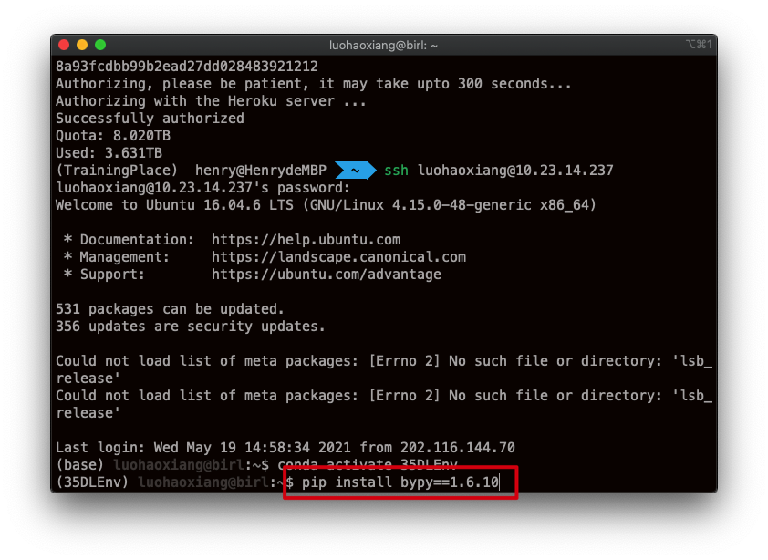
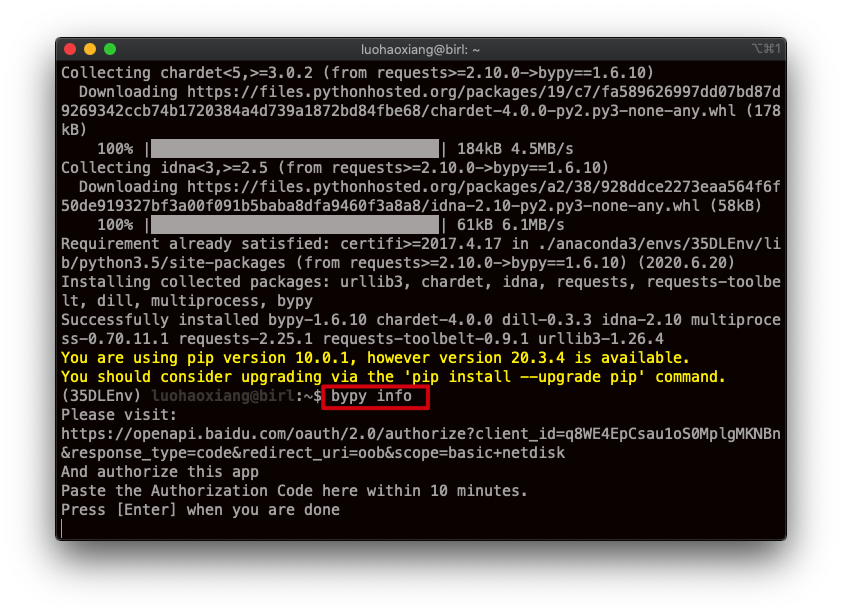
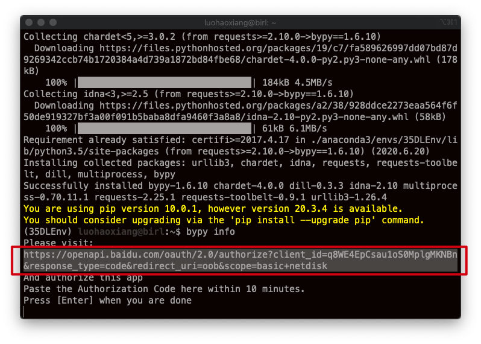
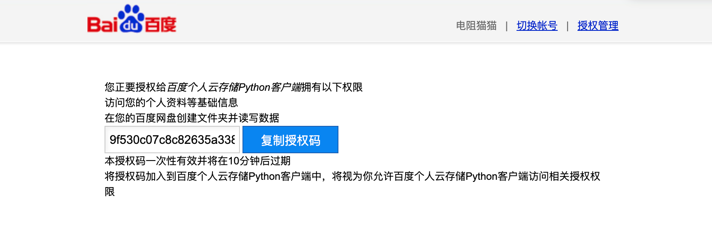
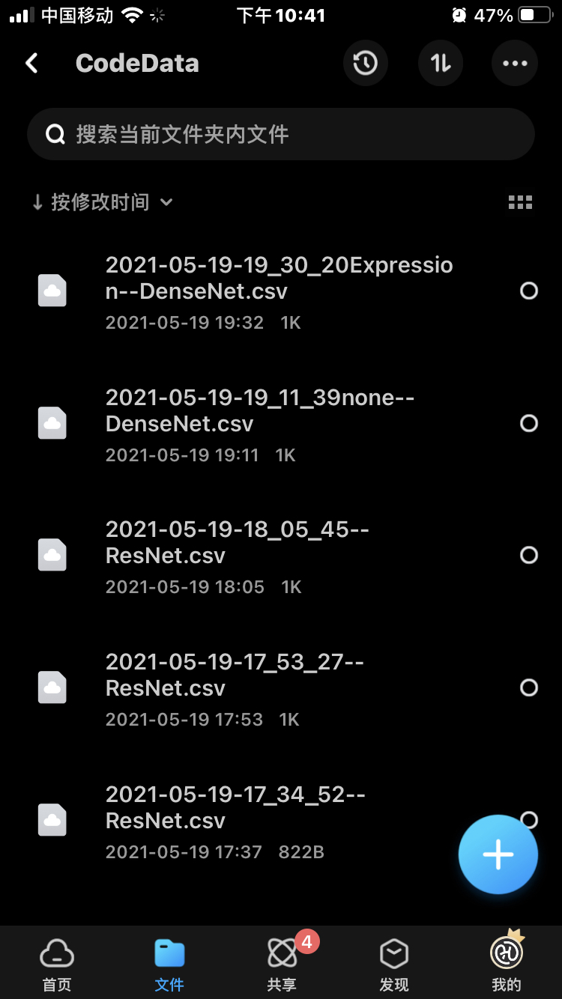
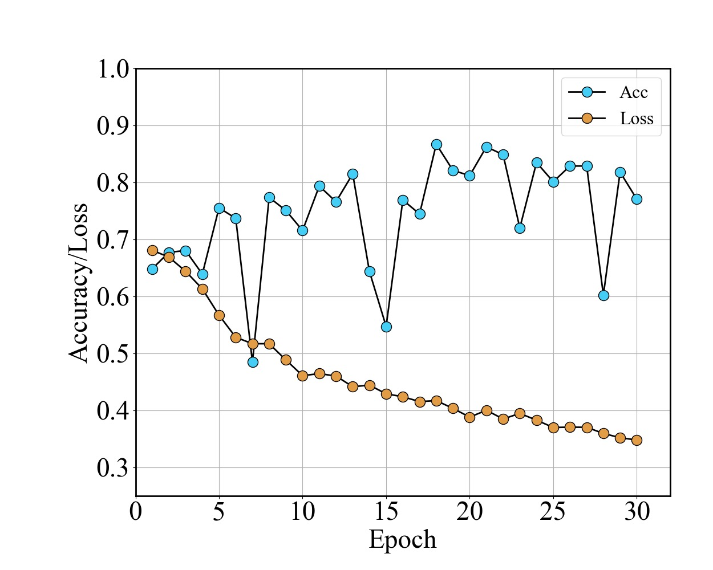
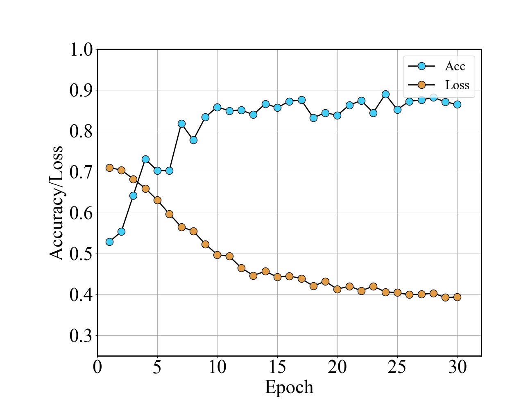
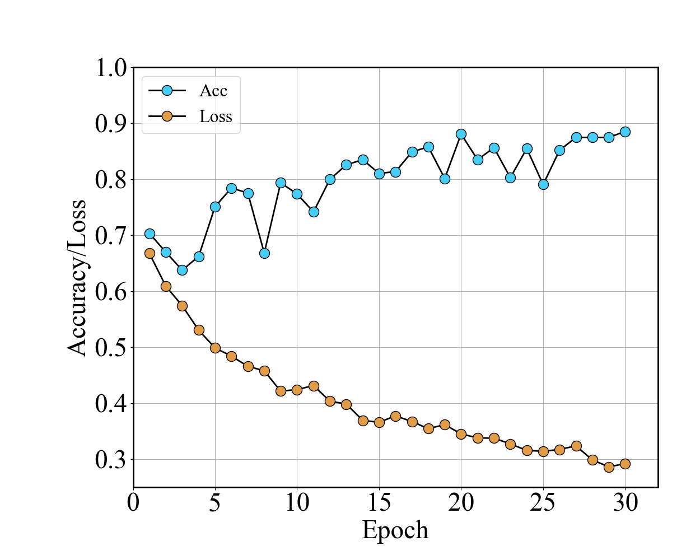
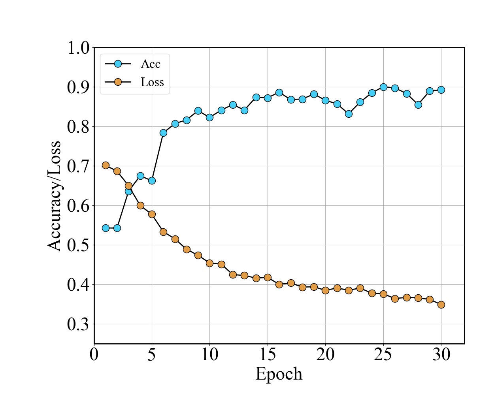

# 使用深度学习方法对面部数据集进行测试
## 开发环境
 
 * Python 3.8.5 x64
 * Pytorch
 * Pandas
 * Bypy（可选）
 * numpy

## IDE
 * PyCharm 2021.03


## 程序运行
这一次使用到了ResNet50, DenseNet121和MobileNetV2三个模型进行训练，在程序文件中，其中：
* DenseNetModel.py
* ResNetModel.py
* MobileNetModel.py
为模型文件，在训练测试时，运行其中的：
* DenseNetTrain.py
* ResNetTrain.py
* MobileNetTrain.py
即可训练该模型。在训练过程中，可选择是训练”性别（输入G）“或是”表情（输入E)“数据集：
![datachoice]](./Doc/GorE.jpg)
输入训练的次数：
![epochchoice]](./Doc/epochtimes.jpg)
输入训练结果保存为csv时的给自己看的参数（会出现在该csv文件的命名里面）：
![note]](./Doc/note.jpg)

## 训练数据保存
每一次训练完成之后，其训练过程中的loss和accuracy会以CSV文件形式全部保存在/DataSave/CSV目录下，同时为了方便服务器训练，也加入了可以将文件同步至百度网盘（主要是为了方便后面的调参），假如有需要用到可以如下操作：
### 在服务器安装bypy:
```
pip install bypy==1.6.10
```

### 配置百度网盘
输入
```
bypy info
```

复制如下网址在浏览器打开：

复制粘贴至终端，并回车即可：

### 同步完成
在每一次训练完成之后，其训练完成的CSV文件会自动同步至自己的百度网盘:


## 图像绘制
直接运行在/DataSave/CSV目录下”CSV2JPG"文件即可，所载入的csv名称需要自己修改一下。

## 训练结果
### ResNet50
性别识别，30Epoch，最高准确率为86.7\%；

表情识别，30Epoch，最高准确率为88.9\%；

### DenseNet121
性别识别，30Epoch，最高准确率为88.5\%；

表情识别，30Epoch，最高准确率为90.0\%；

### MobileNetV2
发现其中还有问题，等修改完再来画图。

## 后续
+ 最近时间有点赶（计算机控制作业要先搞定），可能要过一段时间才能继续完善，最新的进度都会更新到这个github repo；
+ 修正一下MobileNet模型；
+ 完成在服务器端直接绘图并同步至百度网盘；
+ Vision Transformer的进一步完善；
+ MindSpore和PeddlePeddle的粗略使用；
	
## 致谢
1. [知乎专栏](https://www.zhihu.com/column/c_1270867822323548160)